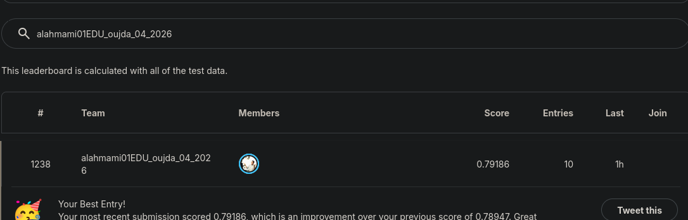

# Titanic Survival Prediction

## Username
alahmami01EDU_oujda_04_2026

## Project Overview
This project aims to predict which passengers survived the Titanic disaster using machine learning.

## Feature Engineering

Train and test are merged into `full_df` so every transformation is applied **identically** to both — this prevents train/test drift.

| Feature | Why it helps |
|---|---|
| `Title` | Encodes social status + age group (Mr / Miss / Mrs / Master / Rare) |
| `FamilySize` | Larger families had lower survival rates |
| `IsAlone` | Travelling alone was a disadvantage |
| `HasCabin` | Cabin presence is a proxy for wealth / Pclass |
| `Age` | Imputed by Pclass × Sex median — smarter than global median |
| `Fare` | Imputed by Pclass median |
| `FarePerPerson` | Normalises fare by group size |

## Model
RandomForestClassifier was used with optimized parameters.

## Final Score
Best Kaggle leaderboard score: **0.79186**

